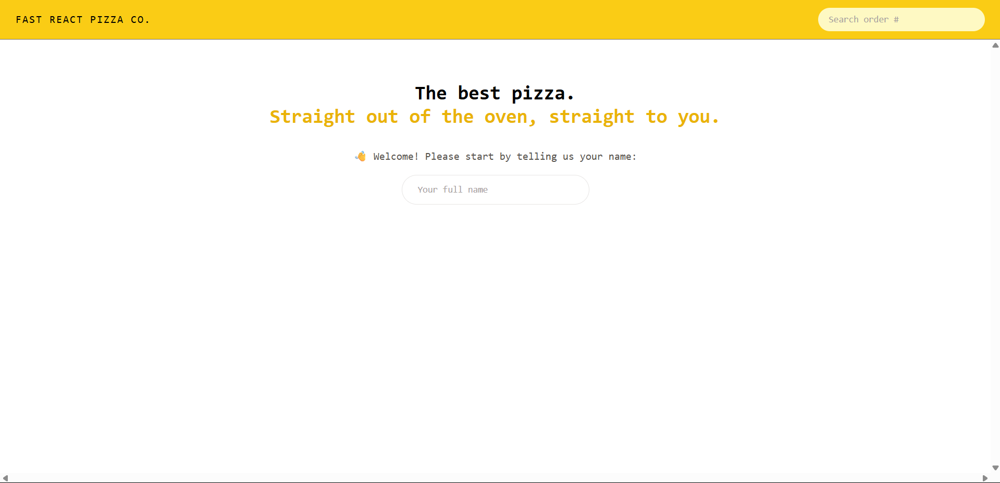

# 🍕 Fast React Pizza Co

A modern, responsive pizza ordering app built with **React**, showcasing component-based architecture, state management with **React Context**, and dynamic routing with **React Router**. This project simulates a full-featured pizza ordering system with cart functionality, real-time updates, and user-friendly UI.



## 🚀 Live Demo

[Check out the app here!!](https://ratneshbvk-fast-react-pizza-co.vercel.app/)

## 📚 Table of Contents

- [Features](#features)
- [Tech Stack](#tech-stack)
- [Installation](#installation)
- [Usage](#usage)
- [Project Structure](#project-structure)
- [License](#license)

---

## ✨ Features

- 🍕 Display available pizzas with prices and ingredients
- 🛒 Add/remove items to cart with quantity management
- 🔢 Real-time price calculation
- 📦 Checkout and order confirmation flow
- 🌗 Responsive design and theming
- ⚛️ Clean, modular React components

---

## 🛠 Tech Stack

- **Frontend**: React, React Router, Redux Toolkit, Tailwind CSS
- **Styling**: Tailwind CSS (utility-first framework)
- **Icons**: React Icons
- **Form Handling**: React Hook Form
- **State Management**: React Redux
- **Deployment**: Vercel

---

## 🧑‍💻 Installation

```bash
# 1. Clone the repository
git clone https://github.com/ratnesh2507/fast-react-pizza-co.git
cd fast-react-pizza-co

# 2. Install dependencies
npm install

# 3. Start the development server
npm run dev

# 4. Open in browser
http://localhost:5173
```

---

## 📁 Project Structure

```bash
fast-react-pizza-co/
│
├── public/               # Static assets
├── src/
│   ├── components/       # Reusable UI components
│   ├── features/         # Feature-specific components (cart, menu, user)
│   ├── context/          # Global context providers
│   ├── pages/            # Page components
│   ├── utils/            # Utility functions
│   ├── hooks/            # Custom React hooks
│   ├── App.jsx           # Root component
│   └── main.jsx          # Entry point
│
├── tailwind.config.js    # Tailwind configuration
├── package.json
└── README.md
```

---

## 🧪 Testing

This project does not include automated tests, but functionality can be tested by navigating through:

- Menu selection
- Cart operations (add, remove, increment, clear)
- Order form submission

---

## 📄 License

This project is licensed under the **MIT License**. See the [LICENSE](./LICENSE) file for details.

---

## 🤝 Connect with Me

- Instagram: [@rockstar_2504](https://instagram.com/rockstar_2504)
---

> Built with ❤️ by Ratnesh
